# NeoPixel Enclosures
 OpenSCAD design files for 3D-printed cases/enclosures for Adafruit's NeoPixel Stick and Strip products.


## Introduction
The Adafruit (@adafruit) NeoPixel products provide an easy and convenient way to add customized lighting effects to any project. The NeoPixel products can be driven from an Arduino or other microprocessors using Adafruit libraries and example code, 3rd-party libraries, or writing custom software that meets the strict timing requirements of the NeoPixel LEDs (e.g. WS2812 LED modules). Please see the [Adafruit NeoPixel Überguide](https://learn.adafruit.com/adafruit-neopixel-uberguide) for more details on the NeoPixel ecosystem, their large array of products using these LEDs, electrical connections and software instructions and examples.

This repository provides OpenSCAD design files for a couple of customizable enclosure designs for the [Adafruit NeoPixel Stick (8x 5050 RGB/RGBW LED) products](https://www.adafruit.com/?q=neopixel+stick&sort=BestMatch), along with utility modules for an Adafruit NeoPixel Stick 3D model, mounting hardware models and a 3-/4-conductor wiring harness tool for model verification and visualization of complete assemblies.

The design files have sensible default enclosure settings and dimensions, but can be easily customized for individual needs. There are customization notes and comments sprinkled through the design files, along with some customization instructions listed below in this README document. The default NeoPixel Stick enclosure type is the *Screw-in Enclosure*, which requires the addition of some M3 mounting hardware in order to stay assembled. The *Screw-in Enclosure* is more robust, but slightly larger than the basic (minimalist) *Simple Enclosure*, which does not require any additional mounting hardware and relies on friction between the overlapping front/back parts to stay assembled (there is currently no snap/latch mechanism in place to keep the parts together, but this is under consideration for future improvement).

OpenSCAD design file notes:
1. All units in mm.
2. Reference level Z=0 is the bottom surface of the NeoPixel Stick PWB, where it sits on the perimeter *lip* of the enclosure back model piece.
3. Similarly, the [X, Y] = [0, 0] origin of the model is the bottom left corner of the PWB, which matches that of Adafruit's EagleCAD design origin.
4. Some design files do use advanced features of OpenSCAD (such as *rotate_extrude()*), so a fairly recent version of OpenSCAD will be required. Models in the repository have been tested using OpenSCAD v. 2021.01 and 2019.05

In the near future, I plan to include enclosure designs for various lengths (parameterizable) of the Adafruit NoePixel Strip, such as the [144 LED/m NeoPixel Digital RGBW LED Strip](https://www.adafruit.com/product/2848), cut to length. Stay tuned ...

## Quick Start
In order to create a complete enclosure, open the two primary enclosure design files:
* **neopixel_x8_stick_case_back.scad**: The back enclosure 3D model part, and
* **neopixel_x8_stick_case_front.scad**: The front enclosure 3D model part

Notice that each design file should automatically provide a *Preview* of the solid model, using the built-in default settings. In each of these design files, the model implementation is near the top of the file, just after the list of includes, embedded in an if statement like so (for the back enclosure part):

```openscad
if ($include_front == undef) {
    neopixel_stick_case_front(screw_case = true, screw_type = "flat");
}
```

The default enclosure type is the *Screw-in Enclosure* (`screw_case = true`). If you would like to create the *Simple Enclosure* instead, change this value to **false** on both front and back enclosure parts. After any changes to module settings, you may preview the changes by saving the design file or hitting the *Preview* button (or F5) in OpenSCAD. When you are satisfied, *Render* the model, *Export as STL* and ... open with your Slicer or other software of choice for implementation on your 3D printer.

Note: You will likely get console warnings in OpenSCAD with these two enclosure design files about unknown variables, such as this:
```
WARNING: Ignoring unknown variable '$include_front' in file neopixel_x8_stick_case_front.scad, line 47
```
You can safely ignore these warnings. They refer to special variables used to assemble all components into a top-level assembly (described below). However, other warnings may warrant investigation and you should ensure that there are no errors, especially after customization or more extensive modification of the design files.

## Going Further: Customization
Peruse the settings and dimensions contained in the **neopixel_case_constants.scad** include file and customize these parameters to meet your own needs. For example, you could move the mounting hardware further away from the ends of the PWB by changing the following line:
```openscad
case_screw_offset = 6;    // From each end of PWB
```
Save your changes and go back to the two enclosure design files to immediately see the impact.

Similarly, if you want to make the enclosure thicker ... modify the following line in **neopixel_case_constants.scad**:
```openscad
extra_back_thickness = 0.25; // used to make overall case assembly a little thicker than the case screw length.
```
If you were to make this 2.25 instead, this increases the thickness by 2 mm. Note that in this case you will probably also want to increase the length of the screws from 10 mm to 12 mm as well, otherwise the screws won't be long enough to thread into the M3 nuts. Just change this line accordingly:
```openscad
case_screw_length = 10;
```
Other settings can be changed in this file as well, such as changing the `cover_wall_thickness` or `cover_overlap_depth`. It is a good idea to verify fit after substantive changes before printing a new highly-customized enclosure part. A good way to do this is using the **neopixel_x8_stick_assy.scad** top-level assembly design file also included in the repository.

The top-level assembly includes both the front and back enclosure parts along with models of the PWB, wiring harness, and mounting hardware if applicable. Additional details on use of the Assembly design file is provided below.

## Simple Enclosure
The *Simple Enclosure* is a minimalist enclosure to provide ease in handling and basic protection to the NeoPixel Stick and companion 3- or 4-conductor wiring harness soldered to the back side of the NeoPixel Stick PWB. The enclosure is comprised of front and back 3D parts, which are the **neopixel_x8_stick_case_front.scad** and **neopixel_x8_stick_case_back.scad** design files referenced above in the Quick Start. 3D printed versions of these two models are shown below.

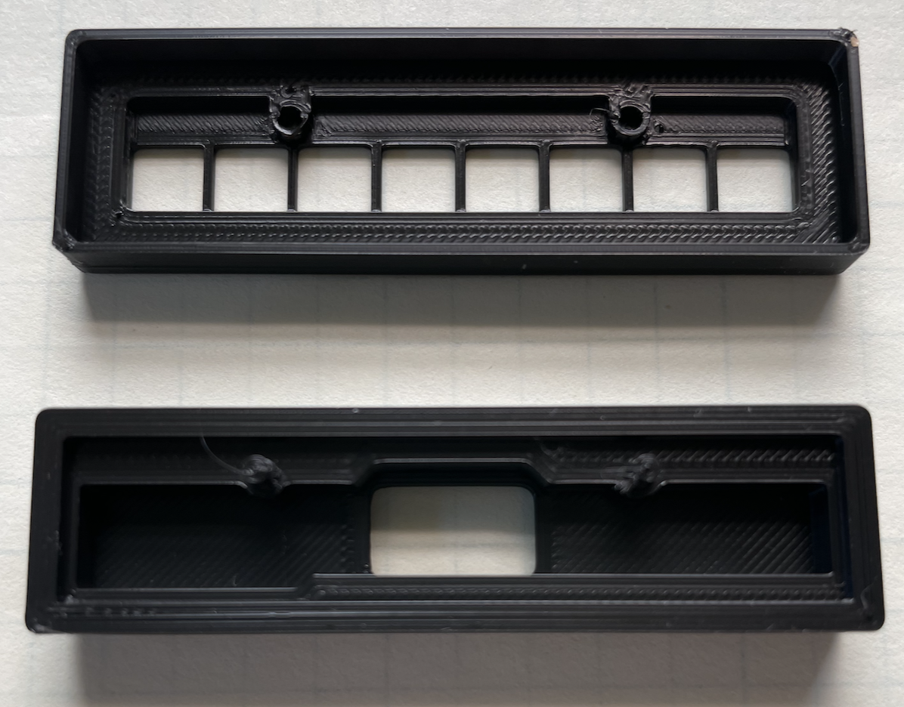 

The *Simple Enclosure* back part is designed to hold the NeoPixel Stick PWB on a perimeter *lip* and provides two cylindrical pegs with which to slide the PWB into place (using the NeoPixel Stick mounting holes). There is also a shallow pocket region behind the PWB which allows space for the wiring harness, providing ample room for solder joints on the PWB pads as well as a reasonable bend radius on the harness wires.

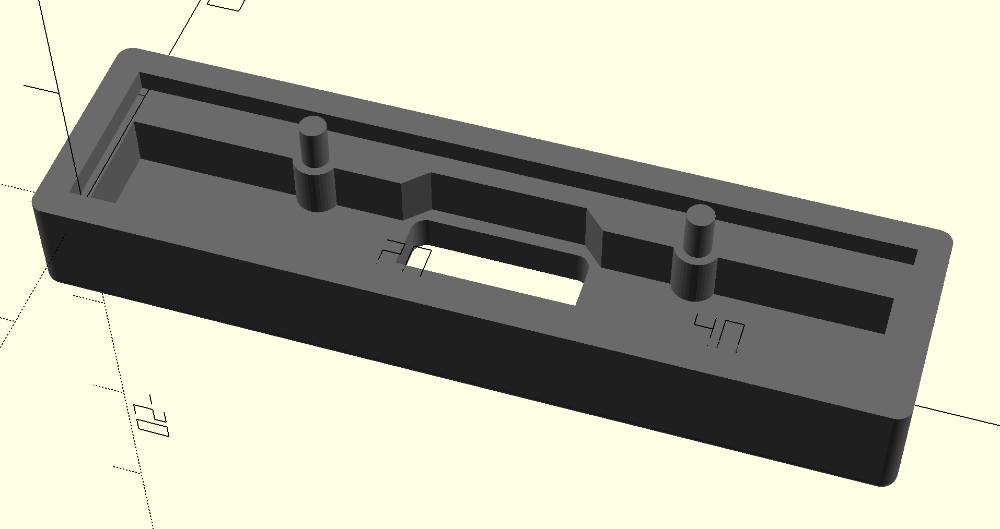

For this enclosure part, the wiring harness is routed through a cutout in the center of the back of the part. Note that the center cutout is sized to allow for a 4-pin JST-PH Socket style connector to fit through, such as when using the [Adafruit JST PH 4-Pin Socket to Color Coded Cable - 200mm](https://www.adafruit.com/product/4045) as the wiring harness for connecting the NeoPixel Stick to the Arduino or other microprocessor.

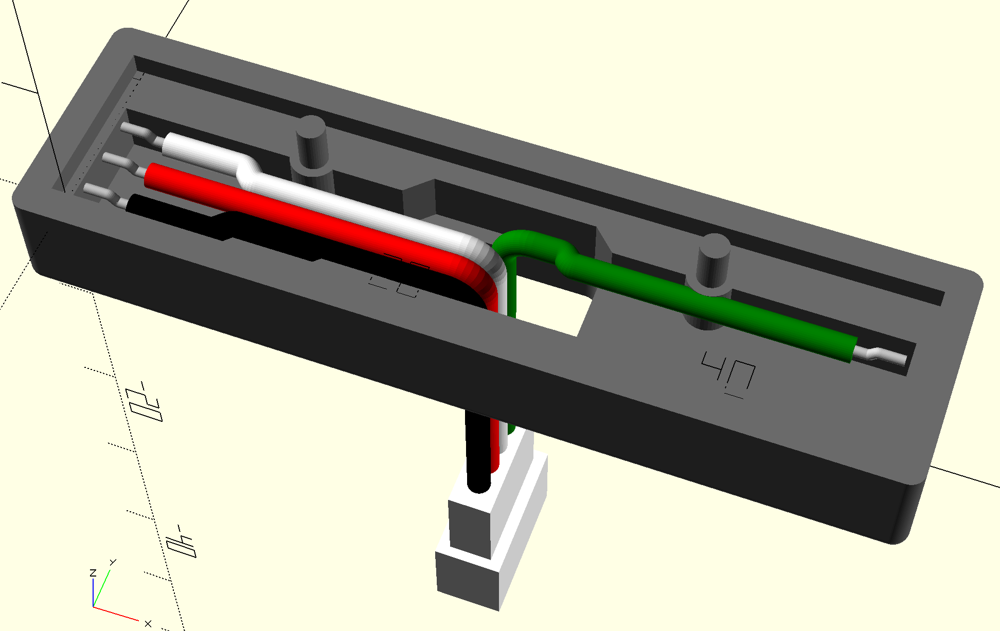

The *Simple Enclosure* front part is designed to overlap the back enclosure part around the periphery; it slides in place over the back part and is currently just held on by friction (there is minimal space between the outer dimensions of the back part and the inner dimensions of the front part). The front part has alignment holes for the mounting pegs on the back enclosure part and cutouts for the 8 LEDs to fit into (and shine brightly through!).
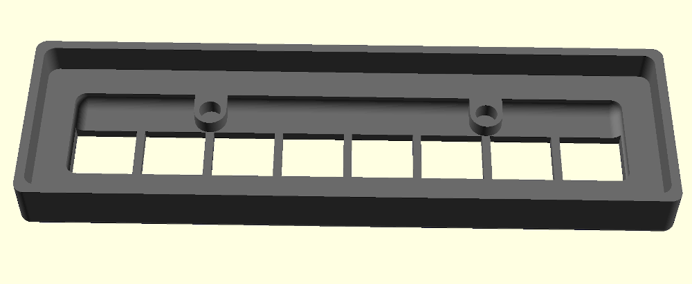

## Screw-in Enclosure
The *Screw-in Enclosure* is a more robust, yet still compact enclosure for the NeoPixel Stick and associated 3- or 4-conductor wiring harness that relies on M3 mounting hardware to keep the assembly together. The *Screw-in Enclosure* has many of the same features as the *Simple Enclosure* described above (e.g. the way the PWB sits in the lip of the back enclosure part, the pocket below PWB for soldered wiring harness, the way the LEDs protrude through the openings in the front enclosure part, etc.). However, it has the added regions on each end of the PWB to incorporate the mounting hardware. 3D printed versions of the *Screw-in Enclosure* parts are shown below.


This enclosure is designed such that mounting hardware can be completely flush-mount, with inset nut pocket in the back of the back enclosure part and inset flat-head screw provision in front enclosure part. 

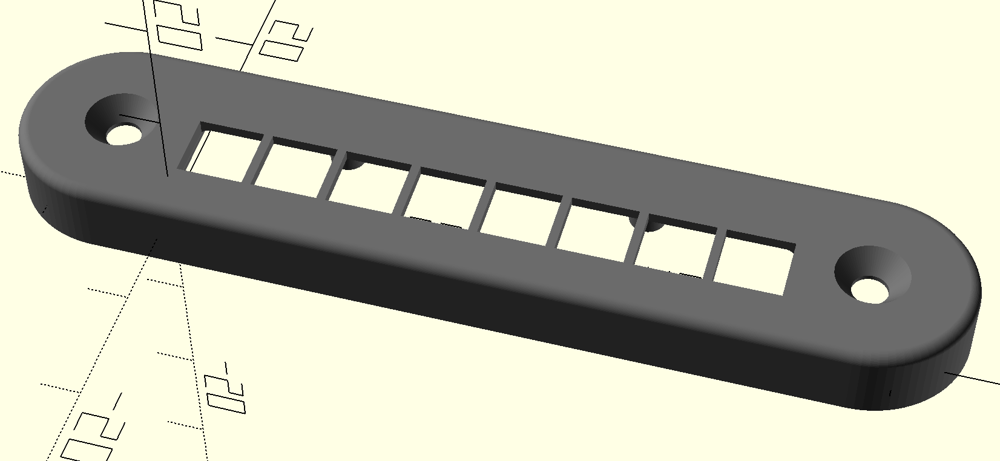 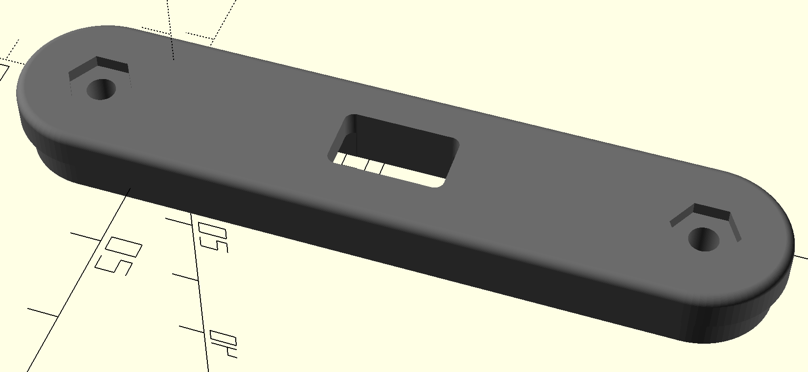

Note that the default setting (`flush_perim = true`) for the back enclosure ensures the back part is also flush with the top part around the periphery of the mating interface of the two parts, like so:

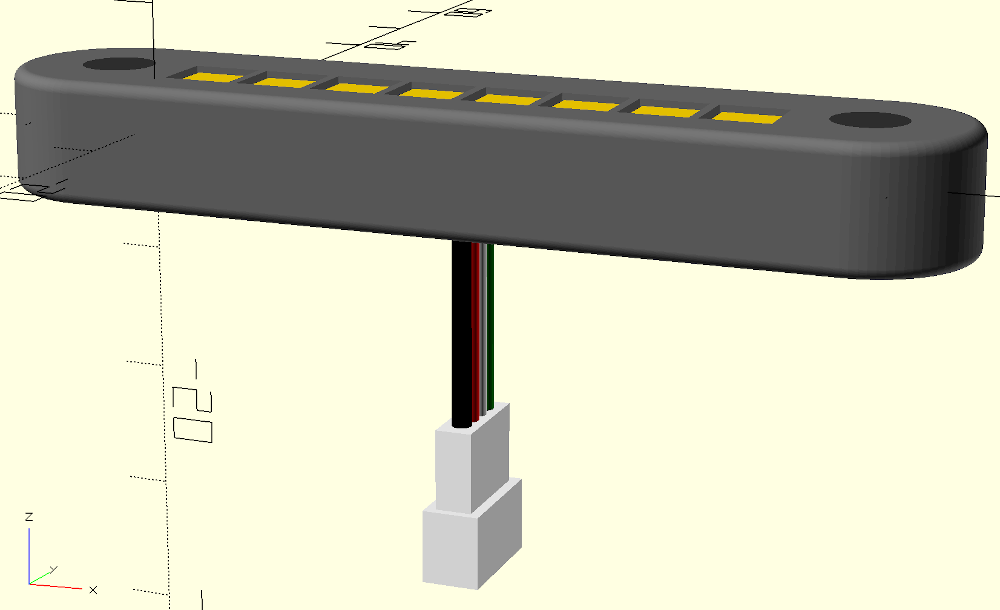

Changing from the default value to `flush_perim = false` would yield a small *step* where the front enclosure part overlaps with the back part:

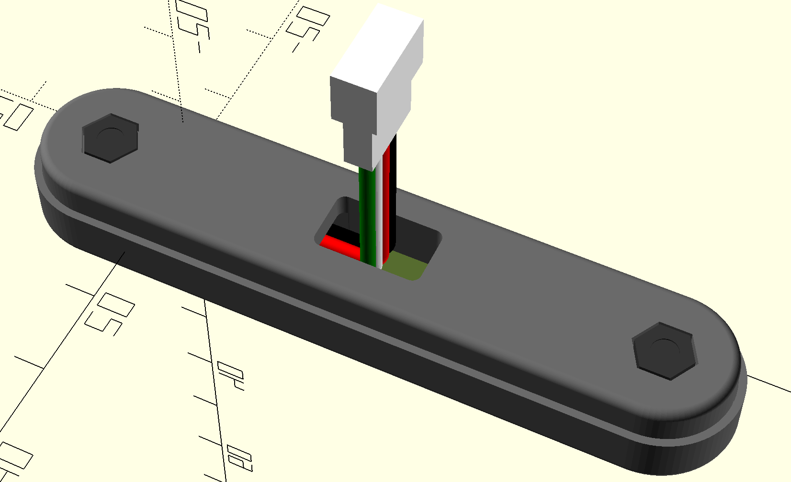

If you don't have flathead M3 screws on-hand, you could use pan-head or other rounded top screw instead (and changing the `screw_type = "rounded"` for the front enclosure part), which will remove the screw head inset:
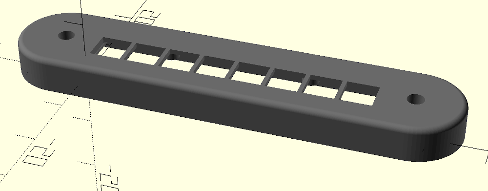

and the screws will protrude slightly from the front of the assembly:

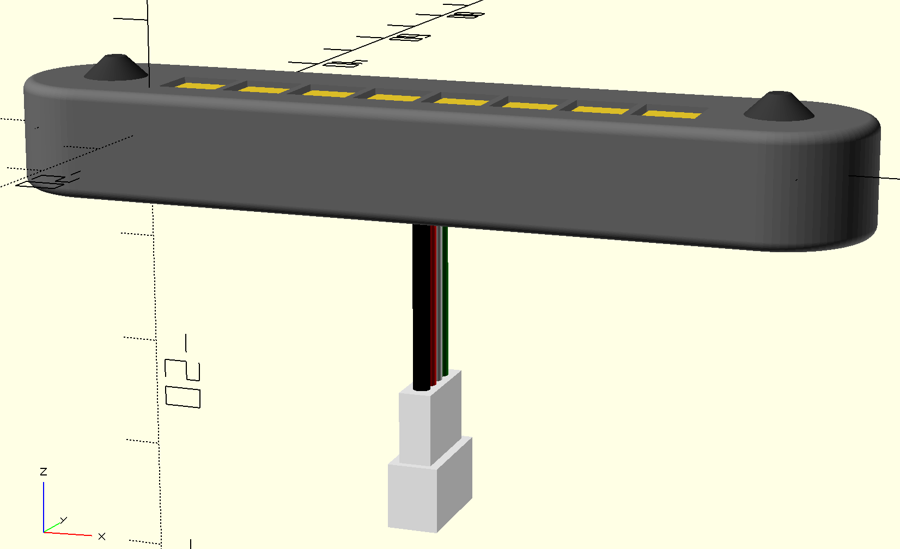

## Assembly and Animation files
As mentioned above in the *Customization* section, this repository provides a top-level assembly design file (**neopixel_x8_stick_assy.scad**) for help in visualizing how the enclosure parts fit together and performing fit check with other components like the NeoPixel PWB, wiring harness, and mounting hardware.
Note that at the top of this file are a series of include files for incorporation of the various enclosure components and utility modules, along with a series of OpenSCAD *Special Variables* (beginning with a $-sign), like this:
```openscad
$include_front = true;
include <neopixel_x8_stick_case_front.scad>
```
You can modify the visibility in the Assembly Preview pane by assigning `true` or `false` to each of these elements and see the results reflected in the Preview pane. Ensure that you don't just delete or move these special variables, or you may get unpredictable results. The order and the very presence of these special variables are critical to how the hierarchy in this repository works.

You can then modify the options listed beneath the list of include files and special variables to control which enclosure type and options you would like to see in the Assembly Preview:
```openscad
// Set various enclosure options here:
screw_case = true;      // 'true' for screw-in version of enclosure, 'false' for simple enclosure
screw_type = "flat";    // set enclosure screw type to "none", "rounded" or "flat"
flush_case = true;      // Used to modify back enclosure piece to be flush with the top around the perimeter
front_alpha = 0.5;      // Set Alpha channel for color rendering of front enclosure part, aid in visualization
include_screws = true;  // include M3 screws for assembly visualization?
include_nuts = true;    // include M3 nuts for assembly visualization?
```
Note that changes to these settings only affect how the assembly view works and does not affect how an individual part is actually implemented or printed (and vice versa). Please make those changes directly on the front and back enclosure parts as described previously as necessary for your application.

One other feature is the use of an **alpha** setting for the rendered color of the front enclosure part. This allows for easier visualization of the assembly, specifically how the front part aligns with the back part and the installed NeoPixel Stick PWB. The default value is `front_alpha = 0.5`, but you can change this to anything between 0.0 (full transparency) to 1.0 (opaque).

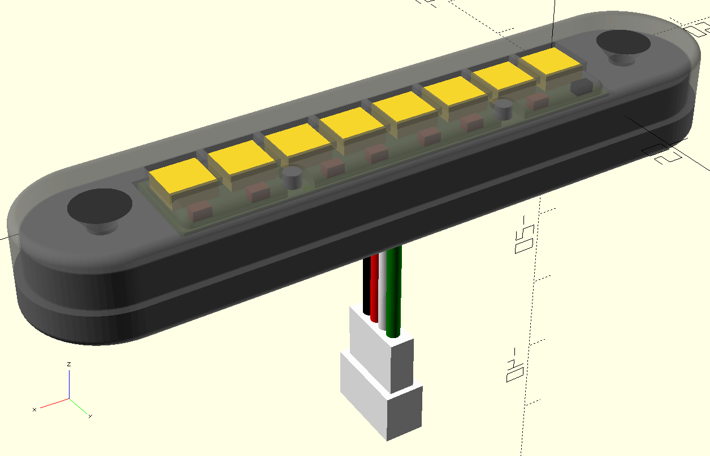

Finally - there is a fun, multi-stage animation of the assembly (**animate/neopixel_x8_stick_assy_animate.scad**) which can also be used for fit-checking and visualization of product assembly. It uses the same approach for settings and part visibility using special variables as the top-level assembly design file described above. In order to see the animation in action, you must first enable it using the OpenSCAD **View -> Animate** menu item, and then in the animation window pane, you should set the **FPS** (frames per second) and **Steps** to some reasonable values (like FPS = 10; Steps = 200). Have fun!

## Utility Modules
In order to help visualize and design the enclosure model parts described above, I created a few utility modules in OpenSCAD as well. These include 3D models of the Adafruit NeoPixel Stick (**neopixel_x8_stick_pwb.scad**) and a parameterizable Wiring Harness(**neopixel_wiring_harness.scad**), each described below. These design files are not intended to be printed, but rather for fit-check or visualization such as in the top-level assembly design or animation files described above.

### Adafruit NeoPixel Stick Assembly Model
Being a staunch supporter of the Open Source hardware and software communities, Adafruit has generously provided the EagleCAD design files (schematic and board layout/routing) for their NeoPixel Stick products on Github: https://github.com/adafruit/NeoPixel-Sticks

All dimensions of my 3D NeoPixel model are based on the V2 version of the NeoPixel Stick board, along with some manual measurements (such as 5050 LED Module height). The EagleCAD design files are in inches, which I have converted to mm manually so any dimensional errors are mine. The NeoPixel Stick OpenSCAD model (**neopixel_x8_stick_pwb.scad**) is shown here:

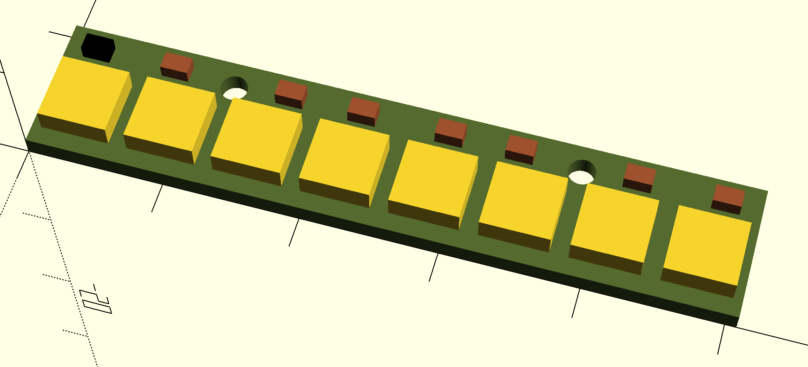

### Wiring Harness Model
The Adafruit NeoPixel Stick/Strip products are designed such that you can daisy-chain multiple sticks/strips in series and effectively drive very long LED chains. There are some practical limitations to how long these chains can be (especially with how you power them), so please check the [Adafruit NeoPixel Überguide](https://learn.adafruit.com/adafruit-neopixel-uberguide) for specifics. As such, in addition to +5V and GND pads each NeoPixel Stick provides both DIN and DOUT signal pads as well.

The wiring harness OpenSCAD model (**neopixel_wiring_harness**) is designed to connect to the appropriate pads of the NeoPixel Stick PWB that uses either 3 wires (5VDC, GND and DIN) for a NeoPixel Stick that is the only stick being used (or the last one in a daisy-chain) or 4 wires (added the DOUT signal) for daisy chaining of NeoPixel sticks. My pinouts for the harness using the Adafruit JST PH cable products referenced earlier are:

Wire Color | 4-Wire Harness | 3-Wire Harness
---------- | -------------- | ----------------
Black      | GND       | GND
Red        | 5VDC      | 5VDC
White      | DIN       | DIN
Green      | DOUT      |

The wiring harness is parameterizable for either 3 or 4 wires, to include a socket or header style termination (or unterminated), and configurable *pigtail* length, wire dogleg, soldered tip bend, etc. See design file for full details and use instructions.


## License
Creative Commons Attribution-NonCommercial-ShareAlike 4.0. Please see accompanying license.txt file for details.

