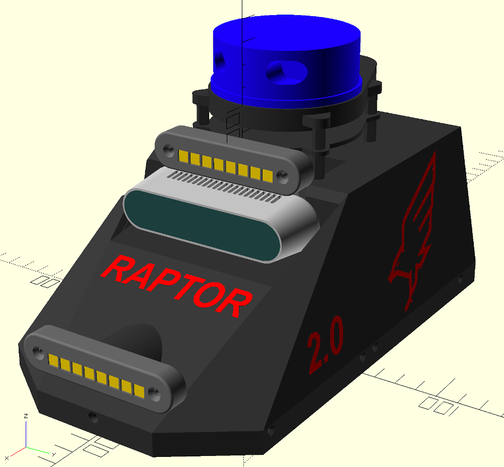
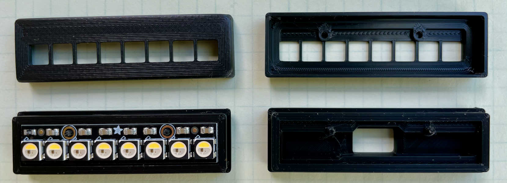
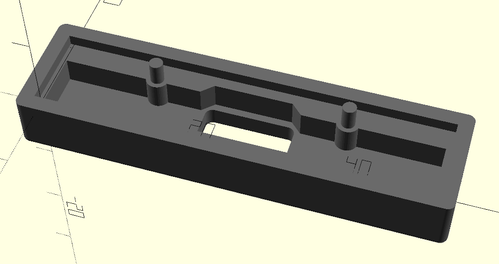
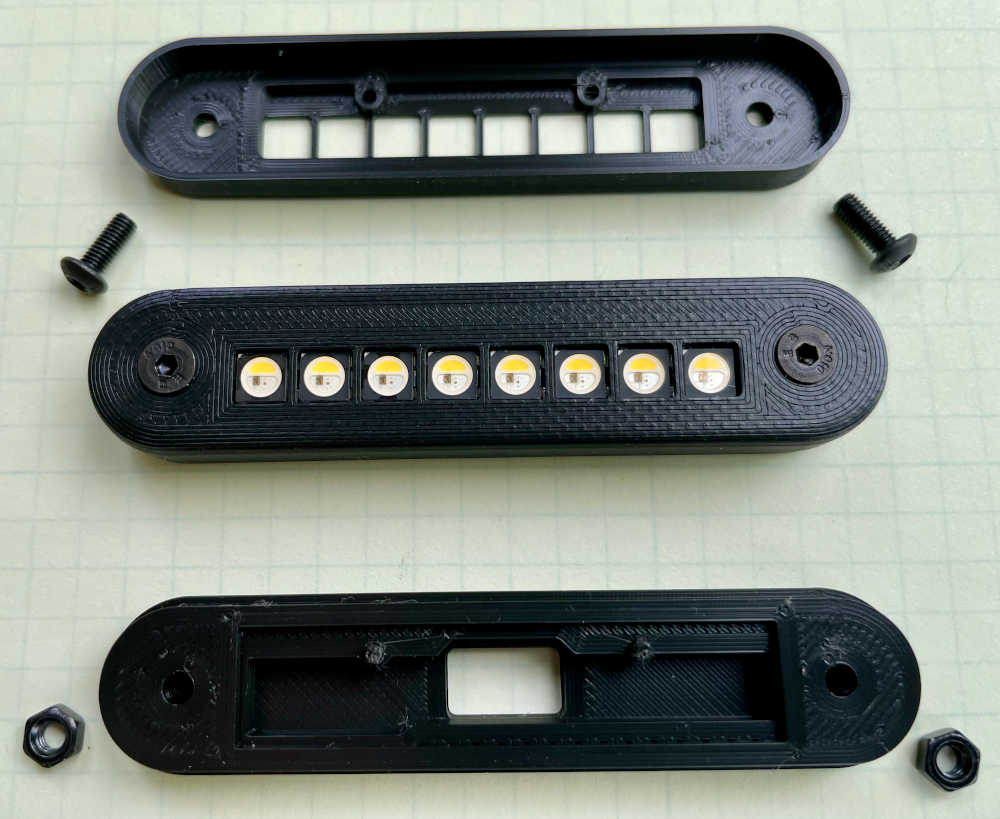
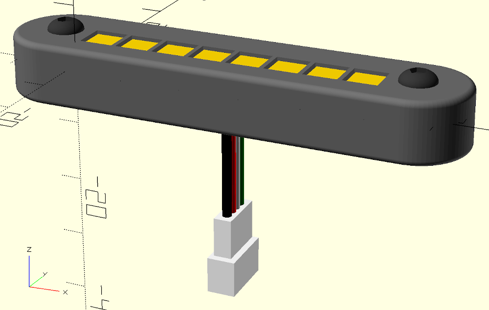
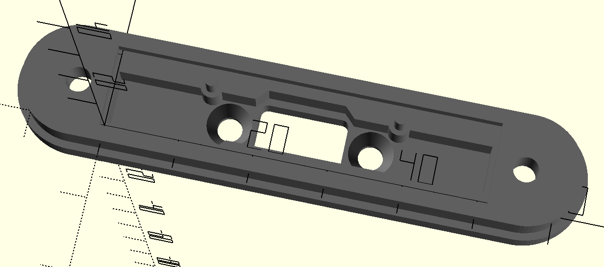
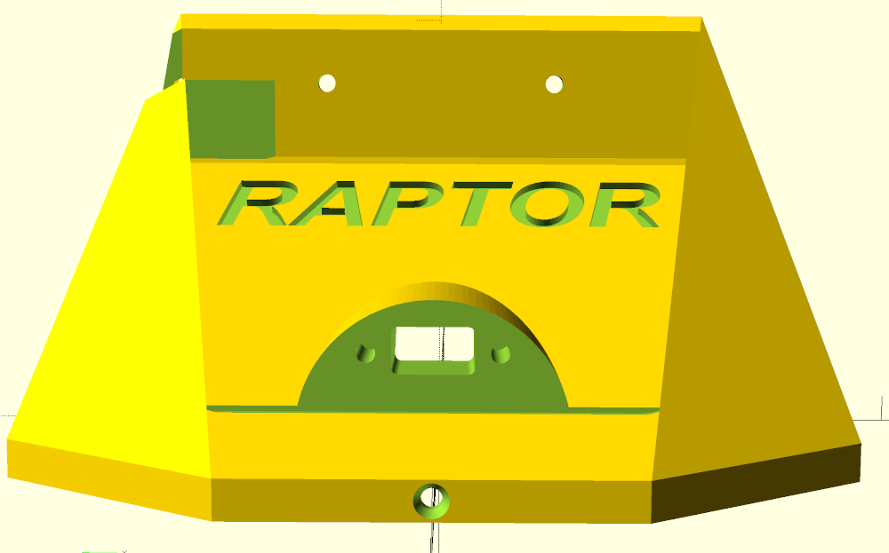
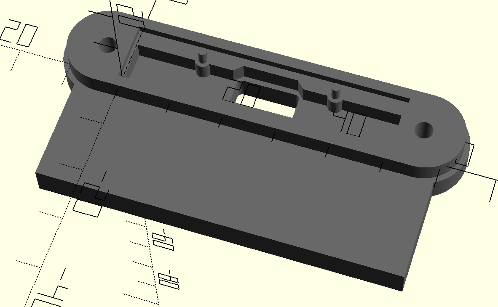
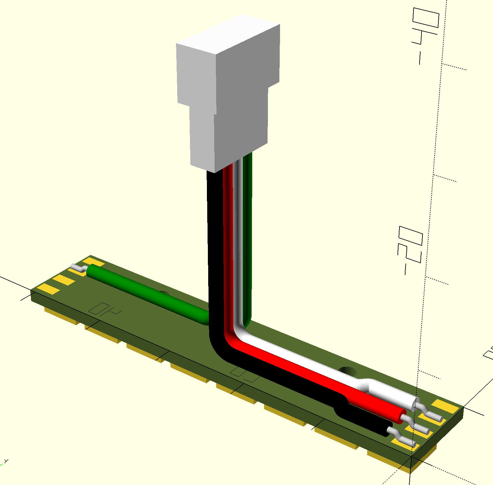

# NeoPixel Enclosures
 OpenSCAD design files for 3D-printed cases/enclosures for Adafruit's NeoPixel Stick and Strip products.


## Introduction
The Adafruit NeoPixel products provide an easy and convenient way to add customized lighting effects to any project. The NeoPixel products can be driven from an Arduino or other microprocessor using Adafruit libraries and example code, 3rd-party libraries, or writing custom software that meets the strict timing requirements of the NeoPixel LEDs (e.g. WS2812 LED modules). Please see the [Adafruit NeoPixel Überguide](https://learn.adafruit.com/adafruit-neopixel-uberguide) for more details on the NeoPixel ecosystem, their large array of products using these LEDs, electrical connections and software instructions and examples.

This repository provides OpenSCAD design files for a couple of customizable enclosure designs for the [Adafruit NeoPixel Stick (8x 5050 RGB/RGBW LED) products](https://www.adafruit.com/?q=neopixel+stick&sort=BestMatch), along with utility modules for an Adafruit NeoPixel Stick 3D model, mounting hardware models and a 3-/4-conductor wiring harness tool for model verification and visualization of complete assemblies.

The design files have sensible default enclosure settings and dimensions, but can be easily customized for individual needs. There are customization notes and comments sprinkled through the design files, along with some customization instructions listed below in this README document. The default NeoPixel Stick enclosure type is the *Screw-in Enclosure*, which requires the addition of some M3 mounting hardware in order to stay assembled. The *Screw-in Enclosure* is more robust, but slightly larger than the basic (minimalist) *Simple Enclosure*, which does not require any additional mounting hardware and relies on friction between the overlapping front/back parts to stay assembled (there is currently no snap/latch mechanism in place to keep the parts together, but this is under consideration for future improvement).

There is also an alternate back enclosure module included that provides a configurable mounting tab off the bottom edge of the enclosure. This alternate back part is designed to work directly with the *Screw-in* front enclosure part as-is.

OpenSCAD design file notes:
1. All units in mm.
2. Reference level Z=0 is the bottom surface of the NeoPixel Stick PWB, where it sits on the perimeter *lip* of the enclosure back model piece.
3. Similarly, the [X, Y] = [0, 0] origin of the model is the bottom left corner of the PWB, which matches that of Adafruit's EagleCAD design origin.
4. Some design files do use advanced features of OpenSCAD (such as *rotate_extrude()*), so a fairly recent version of OpenSCAD will be required. Models in the repository have been tested using OpenSCAD v. 2021.01 and 2019.05

In the near future, I plan to include enclosure designs for various lengths (parameterizable) of the Adafruit NoePixel Strip, such as the [144 LED/m NeoPixel Digital RGBW LED Strip](https://www.adafruit.com/product/2848), cut to length. Stay tuned ...

## Quick Start
In order to create a complete enclosure, open the two primary enclosure design files:
* **neopixel_x8_stick_case_back.scad**: The back enclosure 3D model part, and
* **neopixel_x8_stick_case_front.scad**: The front enclosure 3D model part

Notice that each design file should automatically provide a *Preview* of the solid model (enabled by default in OpenSCAD, or hit the *Preview* button if it is turned off), using the built-in default parameters. In each of these design files, the model implementation is near the top of the file, just after the list of includes, embedded in an if statement like so (for the back enclosure part):

```openscad
if ($include_back == undef) {
    if (!_include_mounting_plate) {
        neopixel_stick_case_back (
            screw_case = true,
            screw_hole_diameter = 3.4,
            screw_depth = 6.5,
            case_screw_separation = 60,
            case_thickness = 10.25,
            add_back_mounting_screws = false,
            flush_perim = true,
            include_nut_pocket = true,
            nut_pocket_depth = 3.5,
            back_alpha = 1.0
        );
    } else {
        ...
```

The default enclosure type is the *Screw-in Enclosure* (`screw_case = true`). If you would like to create the *Simple Enclosure* instead, change this value to **false** on both front and back enclosure parts. After any changes to module settings, you may preview the changes by saving the design file or hitting the *Preview* button (or F5) in OpenSCAD. When you are satisfied, *Render* the model, *Export as STL* and ... open with your Slicer or other software of choice for implementation on your 3D printer.

Note: You will likely get console warnings in OpenSCAD with these two enclosure design files about unknown variables, such as this:
```
WARNING: Ignoring unknown variable '$include_back' in file neopixel_x8_stick_case_back.scad, line 58
```
You can safely ignore these warnings. They refer to special variables used to assemble all components into a top-level assembly (described below). However, other warnings may warrant investigation and you should ensure that there are no errors, especially after customization or more extensive modification of the design files.

## Going Further: Customization
Any of the parameters for the front and back enclosure parts can be modified to suit special needs. For instance, the `case_screw_separation` (distance between the two case mounting screws) can be changed from the default of 60 (mm) to something else, like 75. After modification, save your changes and you will immediately see the effect in the preview or render output of the model (in this case, you will see the case length grow by 15 mm, 7.5 mm on each side left/right of the PWB mounting position).

Note that certain parameters (like `case_screw_separation` and `screw_case`) must be identical in both front and back enclosure parts, otherwise the 3D printed models will not fit together, so use some caution when changing some of these settings.

Similarly, if you wanted to increase the overall thickness of the enclosure (front + back model parts screwed together), by 4.0 mm (perhaps to better match the height or thickness of other objects in a larger project), open the file **neopixel_x8_stick_case_back.scad** and find the line:
```openscad
case_thickness = 10.25,
```
and change parameter setting from the default 10.25 to 14.25, save the file, preview or render the model and you will see the back model part thickness/height increase by 4 mm. Be aware that the default 10.25 mm case_thickness works well for the *Screw-in* enclosure when using 10 mm length M3 screws. Changing the thickness to 14.25 could require the use of longer case screws (say 14 mm), unless you were to do something else to compensate for this such as increasing the nut pocket depth so that the M3 nut will still engage with the screw once assembled.

In addition to customization by modifying the various module parameters, you can also peruse the settings and dimensions contained in the **neopixel_case_constants.scad** include file and customize these parameters to meet your own needs. For example, you could modify the `cover_wall_thickness` or `cover_overlap_depth` settings which will affect construction of both front and back enclosure parts. It is a good idea to verify fit after substantive changes before printing a customized enclosure part. A good way to do this is using the **neopixel_x8_stick_assy.scad** top-level assembly design file also included in the repository.

The top-level assembly includes both the front and back enclosure parts along with models of the PWB, wiring harness, and mounting hardware if applicable. Additional details on use of the Assembly design file is provided below.

## Advanced Use: Adding Neopixel Enclosures to other projects
NeoPixel lighting can easily be added to other OpenSCAD design projects. Typically you will only require the back enclosure model, so you will have to include the **neopixel_x8_stick_case_back.scad** design file in the file from where you need to reference it, as shown here:
```openscad
$include_back = true;
include <"path-to-github-repo"/neopixel-enclosures/neopixel_x8_stick_case_back.scad>
```
where "path-to-github-repo" is an absolute or relative path for the top-level directory above where this repository is installed. Make sure you keep the `$include_back` *special variable* definition in order to work properly (more on this type of special variable is detailed below in the section describing Assembly and Animation design files).

Note that while it is not necessary for the construction of a model part incorporating the NeoPixel Stick Enclosure design, you may also want to include the *front* part for visualization or assembly verification by similarly including its OpenSCAD design files as well:
```openscad
$include_front = true;
include <"path-to-github-repo"/neopixel-enclosures/neopixel_x8_stick_case_front.scad>
```
Also included in the **neopixel_x8_stick_case_back.scad** design file are several accessory modules (described in the next section) to aid in incorporating the enclosure into other, complex assemblies. An example of this is shown below, where two differently customized NeoPixel Stick Enclosure Assemblies are incorporated into a modified version of the [MuSHR Racecar](https://mushr.io/about/) robotic vehicle design:



It has both a headlight assembly plus a top lightbar assembly (above the depth camera) ... Cool!

## Simple Enclosure
The *Simple Enclosure* is a minimalist enclosure to provide ease in handling and basic protection to the NeoPixel Stick and companion 3- or 4-conductor wiring harness soldered to the back side of the NeoPixel Stick PWB. The enclosure is comprised of front and back 3D parts, which are the **neopixel_x8_stick_case_front.scad** and **neopixel_x8_stick_case_back.scad** design files referenced above in the Quick Start. 3D printed versions of these two models are shown below.



The *Simple Enclosure* back part is designed to hold the NeoPixel Stick PWB on a perimeter *lip* and provides two cylindrical pegs with which to slide the PWB into place (using the NeoPixel Stick mounting holes). There is also a shallow pocket region behind the PWB which allows space for the wiring harness, providing ample room for solder joints on the PWB pads as well as a reasonable bend radius on the harness wires.



For this enclosure part, the wiring harness is routed through a cutout in the center of the back of the part. Note that the center cutout is sized to allow for a 4-pin JST-PH Socket style connector to fit through, such as when using the [Adafruit JST PH 4-Pin Socket to Color Coded Cable - 200mm](https://www.adafruit.com/product/4045) as the wiring harness for connecting the NeoPixel Stick to the Arduino or other microprocessor.


The *Simple Enclosure* front part is designed to overlap the back enclosure part around the periphery; it slides in place over the back part and is currently just held on by friction (there is minimal space between the outer dimensions of the back part and the inner dimensions of the front part). The front part has alignment holes for the mounting pegs on the back enclosure part and cutouts for the 8 LEDs to fit into (and shine brightly through!).


## Screw-in Enclosure
The *Screw-in Enclosure* is a more robust, yet still compact enclosure for the NeoPixel Stick and associated 3- or 4-conductor wiring harness that relies on M3 mounting hardware to keep the assembly together. The *Screw-in Enclosure* has many of the same features as the *Simple Enclosure* described above (e.g. the way the PWB sits in the lip of the back enclosure part, the pocket below PWB for soldered wiring harness, the way the LEDs protrude through the openings in the front enclosure part, etc.). However, it has the added regions on each end of the PWB to incorporate the mounting hardware. 3D printed versions of the *Screw-in Enclosure* parts are shown below along with various assembly hardware options.



This enclosure is designed such that mounting hardware can be completely flush-mount, with inset nut pocket in the back of the back enclosure part and inset flat-head screw provision in front enclosure part. 

 

Note that the default setting (`flush_perim = true`) for the back enclosure ensures the back part is also flush with the top part around the periphery of the mating interface of the two parts, like so:


Changing from the default value to `flush_perim = false` would yield a small *step* where the front enclosure part overlaps with the back part:


If you don't have flathead M3 screws on-hand, you could use pan-head or other rounded top screw instead (and changing the `screw_type = "rounded"` for the front enclosure part), which will remove the screw head inset:


and the screws will protrude slightly from the front of the assembly:



On the back enclosure part in particular, there are additional settings for the `screw_hole_diameter`, `screw_depth`, `include_nut_pocket` and `nut_pocket_depth` allow for even greater control over mounting hardware and options. For instance, setting `include_nut_pocket = false,` and the `screw_hole_diameter = 2.9,` allows for self-threading of an M3 screw into the back part instead of requiring a nut. In this case though you will want to use a shorter M3 screw to assemble the parts (6 mm or 8 mm length). See the comments in the design file for more detail on the use of these additional parameters.

The *Screw-in Enclosure* is a great way to protect and view the NeoPixel Stick and the lighting pattern driven to it. However, often the enclosure assembly will need to be mounted to something in order to be useful for your projects. An easy way to do this is to turn on the `add_back_mounting_screws` for the back enclosure part (set this value to `true`), and two M3 flathead/inset screw-holes will be added to the part as shown below:



Note that no change is required to the front enclosure part for this option since this option only affect construction of the back part. If you are planning to mount this assembly to another OpenSCAD design project, you will need to ensure that there are clearance holes (or self-threading screw holes) in the part you will be mounting the NeoPixel Assembly to. You will also need to ensure that there is a clearance region or hole to allow the wiring harness to pass through the back of the NeoPixel enclosure to connect to power and digital control from the PWB that will be driving the lighting pattern. In order to assist the user with this operation, a couple of extra accessory modules are provided in the **neopixel_x8_stick_case_back.scad** design file: *HarnessCutoutRegionExtended()*, *MountingScrewsCutoutRegion()* and *NeopixelCaseCutoutRegion()*. Using the same modified [MuSHR Racecar](https://mushr.io/about/) example from above, the following image shows the use of these accessory modules to create mounting provisions for the headlight assembly on the front cover model piece:



### Alternate Back Enclosure Module with Mounting Tab
As an alternative to mounting the enclosure to other objects using the `add_back_mounting_screws` parameter described above, the *neopixel_stick_case_back_on_mounting_plate()* module (in the **neopixel_x8_stick_case_back.scad** design file) provides this capability with the addition of a mounting tab/plate. This alternate back module has configurable parameters for the mounting plate dimensions and is fully compatible with the *Screw-in* version of the front enclosure part.
Note that the `mounting_plate_width` parameter represents the width of the entire model part (i.e. it includes the width of the NeoPixel Enclosure itself).

This alternate back module has many of the same configuration parameters as the regular back part, but is currently only designed to work with the *Screw-in* enclosure style and forced `fluch_perim = true` setting. It also forces certain dimensional properties on the resulting part. In particular, it has no `case_thickness` parameter, but instead derives this value and constructs the model thickness based upon the need for the flush "bumpout" region to be equal to the `mounting_plate_thickness` parameter (this is to ensure that nothing obstructs installation of the front enclosure part to this back part). Also, the current implementation of this alternate back part does not have any through holes for screws in the mounting tab itself. You will have to add these manually in the desired locations (using the OpenSCAD *difference()* operator).

In order to print this version of the back enclosure part (instead of the default back model), look for the following lines at the top of **neopixel_x8_stick_case_back.scad**:
```openscad

// What are we rendering? Either the Enclosure Back part by itself or installed on
// mounting plate (such as for use with MuSHR Racecar chassis components):
_include_mounting_plate = false;
```
and change `_include_mounting_plate` to `true`, and you will get this:



Continuing with the MuSHR design example detailed above, I replaced the T265 Mounting Plate (designed to allow mounting of both a RealSense D435i Depth Camera + T265 Tracking camera above it), with a *neopixel_stick_case_back_on_mounting_plate()* module and using the original dimensions from the T265 mounting plate ... resulting in this:


The mounting holes shown in the mounting plate are aligned with the threaded holes of the depth camera and both this plate and depth camera are screwed into the racecar cover using M3 screws.

## Assembly and Animation files
As mentioned above in the *Customization* section, this repository provides a top-level assembly design file (**neopixel_x8_stick_assy.scad**) for help in visualizing how the enclosure parts fit together and performing fit check/verification with other components like the NeoPixel PWB, wiring harness, and mounting hardware.
Note that at the top of this file are a series of include files for incorporation of the various enclosure components and utility modules, along with a series of OpenSCAD *Special Variables* (beginning with a $-sign), like this:
```openscad
$include_front = true;
include <neopixel_x8_stick_case_front.scad>
```
You can modify the visibility in the Assembly Preview pane by assigning `true` or `false` to each of these elements and see the results reflected in the Preview pane. Ensure that you don't just delete or move these special variables, or you may get unpredictable results. The order and the very presence of these special variables are critical to how the hierarchy in this repository works.

You can then modify the options listed beneath the list of include files and special variables to control which enclosure type and options you would like to see in the Assembly Preview:
```openscad
// Set various enclosure options here:
screw_case = true;      // 'true' for screw-in version of enclosure, 'false' for simple enclosure
screw_type = "flat";    // set enclosure screw type to "none", "rounded" or "flat"
flush_case = true;      // Used to modify back enclosure piece to be flush with the top around the perimeter
front_alpha = 0.5;      // Set Alpha channel for color rendering of front enclosure part, aid in visualization
back_alpha = 1.0;       // Set Alpha channel for color rendering of back enclosure part, aid in visualization
case_screw_length = 10; // length of the physical mounting screws
include_screws = true;  // include M3 screws for assembly visualization?
include_nuts = true;    // include M3 nuts for assembly visualization?
case_thickness = 10.25; // Overall Enclosure thickness (front and back parts assembled)
case_screw_separation = 60.0;     // Center-to-Center distance of the two case mounting screws
add_back_mounting_screws = false; // Add Mounting screws to back enclosure part
```
Note that changes to these settings only affect how the assembly view works and does not affect how an individual part is actually implemented or printed (and vice versa). Please make those changes directly on the front and back enclosure parts as described previously as necessary for your application.

One other feature is the use of an **alpha** setting for the rendered color of the front and back enclosure parts. This allows for easier visualization of the assembly, specifically how the front part aligns with the back part and the installed NeoPixel Stick PWB. The default value is `front_alpha = 0.5`, but you can change this to anything between 0.0 (full transparency) to 1.0 (opaque).


Finally - there is a fun, multi-stage animation of the assembly (**animate/neopixel_x8_stick_assy_animate.scad**) which can also be used for fit-checking and visualization of product assembly. It uses the same approach for settings and part visibility using special variables as the top-level assembly design file described above. In order to see the animation in action, you must first enable it using the OpenSCAD **View -> Animate** menu item, and then in the animation window pane you should set the **FPS** (frames per second) and **Steps** to some reasonable values (like FPS = 10; Steps = 200). Have fun!

## Utility Modules
In order to help visualize and design the enclosure model parts described above, I created a few utility modules in OpenSCAD as well. These include 3D models of the Adafruit NeoPixel Stick (**neopixel_x8_stick_pwb.scad**) and a parameterizable Wiring Harness(**neopixel_wiring_harness.scad**), each described below. These design files are not intended to be printed, but rather for fit-check or visualization such as in the top-level assembly design or animation files described above.

### Adafruit NeoPixel Stick Assembly Model
Being a staunch supporter of the Open Source hardware and software communities, Adafruit has generously provided the EagleCAD design files (schematic and board layout/routing) for their NeoPixel Stick products on Github: https://github.com/adafruit/NeoPixel-Sticks

All dimensions of my 3D NeoPixel model are based on the V2 version of the NeoPixel Stick board, along with some manual measurements (such as 5050 LED Module height). The EagleCAD design files are in inches, which I have converted to mm manually so any dimensional errors are mine. The NeoPixel Stick OpenSCAD model (**neopixel_x8_stick_pwb.scad**) is shown here:


### Wiring Harness Model
The Adafruit NeoPixel Stick/Strip products are designed such that you can daisy-chain multiple sticks/strips in series and effectively drive very long LED chains. There are some practical limitations to how long these chains can be (especially with how you power them), so please check the [Adafruit NeoPixel Überguide](https://learn.adafruit.com/adafruit-neopixel-uberguide) for specifics. As such, in addition to +5V and GND pads each NeoPixel Stick provides both DIN and DOUT signal pads as well.

The wiring harness OpenSCAD model (**neopixel_wiring_harness**) is designed to connect to the appropriate pads of the NeoPixel Stick PWB that uses either 3 wires (5VDC, GND and DIN) for a NeoPixel Stick that is the only stick being used (or the last one in a daisy-chain) or 4 wires (added the DOUT signal) for daisy chaining of NeoPixel sticks. My pinouts for the harness using the Adafruit JST PH cable products referenced earlier are:

Wire Color | 4-Wire Harness | 3-Wire Harness
---------- | -------------- | ----------------
Black      | GND       | GND
Red        | 5VDC      | 5VDC
White      | DIN       | DIN
Green      | DOUT      |

The wiring harness is parameterizable for either 3 or 4 wires, to include a socket or header style termination (or unterminated), and configurable *pigtail* length, wire dogleg, soldered tip bend, etc. See design file for full details and use instructions.



## License
Creative Commons Attribution-NonCommercial-ShareAlike 4.0. Please see accompanying license.txt file for details.

